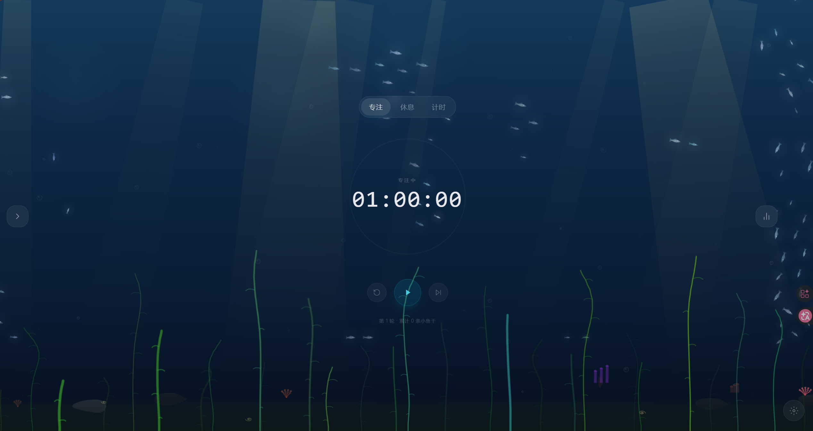
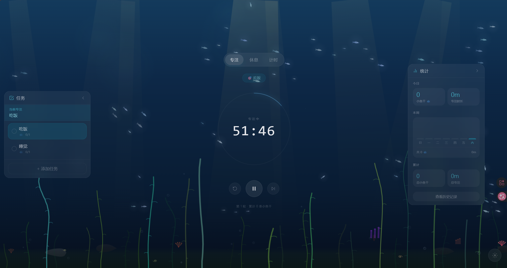
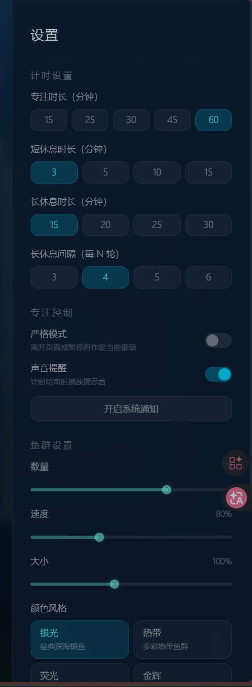

# 深海专注计时器

一款深海主题的番茄钟与专注助手应用，结合流动的海洋动画、任务管理、时间统计和严格模式，为专注场景设计了更沉浸、更有仪式感的体验。（主要是想看鱼）

## 主要功能

- 番茄钟计时：支持专注 / 短休息 / 长休息切换
- 深海动画背景：Boids 鱼群、海草、气泡、阳光、珊瑚等动态视觉效果
- 任务管理：新增任务、设置预计小鱼干、切换当前任务
- 数据统计：今天/本周/累计专注时长、鱼干数量统计
- 严格模式：离开页面或暂停时会作废当前专注
- 声音与通知：Web Audio API 提示音 + 浏览器通知提醒
- 秒表计时：适合临时计时、记录连续活动时长
- 本地持久化：状态和数据保存在浏览器 localStorage 中

## 软件截图

<div align="center">
  
  <br /><br />
  
  <br /><br />
  
</div>

## 演示视频
 您的浏览器不支持视频播放，请 <a href="docs/video/demo.mp4">点击下载</a> 观看。
<div align="center">
  <video src="docs/video/demo.mp4" controls width="900">
</div>

## Windows 快速开始

### 1）安装基础软件

请先安装以下软件：

- Git: https://git-scm.com/download/win
- Node.js LTS: https://nodejs.org/

安装完成后，打开 PowerShell 或 Git Bash，确认环境：

```bash
git --version
node -v
npm -v
```

### 2）安装 pnpm

```bash
npm install -g pnpm
```

### 3）克隆项目

```bash
git clone <你的仓库地址>
cd boids_timer-main
```

### 4）安装依赖

```bash
pnpm install
```

### 5）启动开发环境

#### 方式一：直接运行

```bash
pnpm dev
```

#### 方式二：使用脚本

```bash
start.bat
```

启动后访问：

```text
http://localhost:3000
```

### 6）生产构建

```bash
pnpm build
pnpm start
```

## 常用命令

```bash
pnpm dev      # 启动开发服务器
pnpm build    # 构建生产环境
pnpm start    # 启动生产服务器
pnpm lint     # 代码检查
pnpm ts-check # TypeScript 类型检查
```

## 项目结构

```text
boids_timer-main/
├── src/
│   ├── app/                # App Router 页面入口
│   ├── components/         # 计时器、任务、统计、动画组件
│   ├── lib/                # 公共工具
│   └── hooks/              # 自定义 Hook
├── public/                 # 静态资源
├── scripts/                # 启动/构建脚本
├── package.json            # 项目配置和脚本
├── pnpm-lock.yaml          # pnpm 锁文件
├── start.bat               # Windows 启动脚本
├── start.sh                # Linux / macOS 启动脚本
├── README.md               # 项目说明
├── DESIGN.md               # 设计说明
└── AGENTS.md               # 项目说明与开发约束
```

## 说明与声明

本项目是在 Coze 空间中进行开发与迭代的，部分功能和交互逻辑依赖该环境的运行方式与自动化能力，因此在不同环境中可能出现兼容性差异、自动渲染行为不一致或脚本/状态同步问题。

- 本项目使用 Next.js 16 + React 19 + TypeScript
- 数据默认保存在浏览器本地存储，不依赖后端服务


该项目仍处于持续优化阶段，部分功能可能存在未完全覆盖的边界情况，例如：

- 自动渲染与手动刷新之间的状态差异
- 不同浏览器或运行环境的兼容性差异
- 本地存储、定时器恢复与页面生命周期之间的交互细节
- 一些 UI 或交互细节仍在逐步修正中

如果你在本地运行或二次开发时遇到问题，建议优先以本地 Node.js / Next.js 环境为准进行调试，并以实际页面行为为主来排查问题。

## 许可证

本项目仅用于学习、展示和个人使用，如需商用请联系项目维护者。
